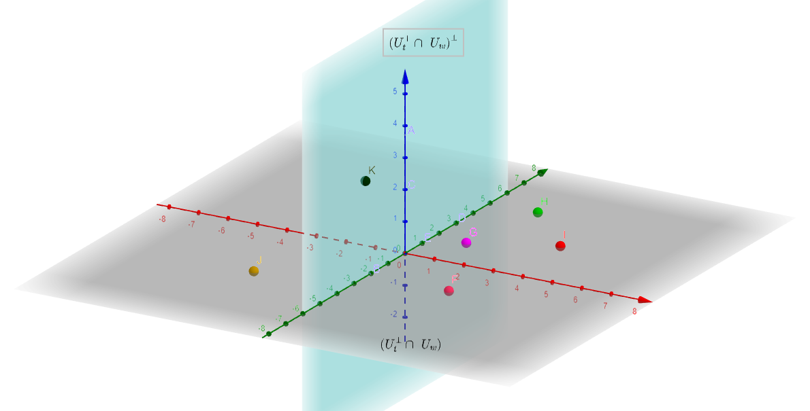

# NullSpaceNet:  Nullspace Convoluional Neural Network with Differentiable Loss Function

## Abstract 

We propose NullSpaceNet, a novel network that maps from the pixel level input to a joint-nullspace (as opposed to the traditional feature space), where the newly learned joint-nullspace features have clearer interpretation and are more separable. NullSpaceNet ensures that all inputs from the same class are collapsed into one point in this new joint-nullspace, and the different classes are collapsed into different points with high separation margins. Moreover, a novel differentiable loss function is proposed that has a closed-form solution with no free-parameters.
NullSpaceNet exhibits superior performance when tested against VGG16 with fully-connected layer over 4 different datasets, with accuracy gain of up to 4.55%, a reduction in learnable parameters from ∼ 135M to ∼ 19M , and reduction in inference time of ∼ 99% in favor of NullSpaceNet. This means that NullSpaceNet needs less than 1% of the time it takes a traditional CNN to classify a batch of images with better accuracy.    (Submitted to ECCV2020)


# Geometric Illustarion of NullSPaceNet





# Results


# Training

For the first 100 epochs set lambda (lamb) in the helpers.py (the loss function) to 0.00001.  Then, set lamb=0.001.

Set the learning rat lr=1e-4 for the first 100 epochs without geometry anneling .

After 100 epochs set lr =1e-5  with geometry anneling = 0.99 each step.

Note that NullSpaceNet needs low learning rate in opposite to tradional CNN.

The code allows you to train  using NullSpaceNet, Vgg16+FC, NullSpaceNet+ FC, NullSpaceNet with pretrained networks, NullSpaceNet from scratch ...


Download the pretrained network  [NullSpaceNet](https://drive.google.com/file/d/1HxGMRq3eD8Dg8_5QQeicw2lH-emq7zaP/view)

Download the pretrained network  [VGG16+FC](https://drive.google.com/file/d/1j3CqcowCKN3l2NvKBh0l8QxNBryYVXYV/view)

Make a new folder (model) and put the pretrained models in it.

# Inference

Inference is don in infrence.y file. For more details please refer to the papper. 


## Requirements

1. Python 3.6 to compile differentiable SVD

2. C compiler to compile SVD

3. Python 3.7

4. Pytorch-1.4.0 torchvision-0.5.0

5. Cuda 10.1

6. PIL

7. Scipy

8. Matplotlib

9. numpy-1.18.1 

10. pillow-7.0.0 six-1.14.0 

   ​


**The code has been tested on Linux 19.10 and TITAN XP GPU**

# Download NullSpaceNet

```
git clone git@github.com:NullSpaceNet/NullSpaceNet.git
```


